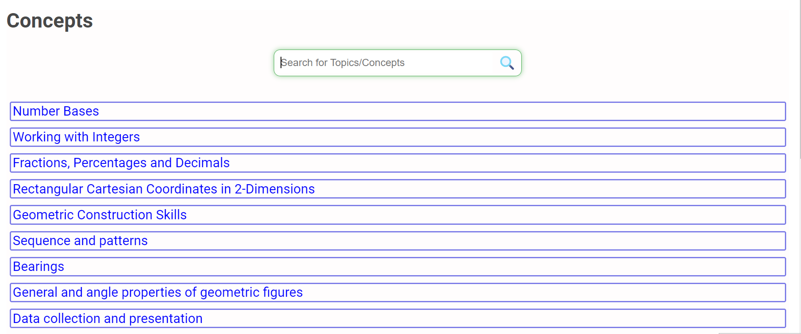

# Maths Resource Kit
> _Facilitating Effective Learning for New Lower Secondary Curriculum in Uganda_

## Introduction
[Maths Resource Kit](https://mrk.robkj.tech/) (MRK) is a web application platform that recommends curated `Mathematics resources` such as articles, blogs, videos and interactive tools from all over the internet to meet the need for understanding Mathematics concepts for a competence based learning strategy for `Lower Secondary Level`. Although the platform enlists concepts according to Uganda's curriculum, it is meant to support **every** Lower Secondary Level student/learner.

Click [here](https://mrk.robkj.tech/) to access the platform
- Find more about MRK at this [blog]() 

## Author
- Ssekyene Robert - [LinkedIn](https://www.linkedin.com/in/robertssekyene/)

## Usage
You may browse by scrolling through the available concepts or search for any concept using the search bar.

Each concept has got:
- An Introduction
- Recommended resources
- Quiz questions
- Activities of Integration
- and Conclusion

All these with an aim of catering for a remarkable learning experience... 🚀

## Contribution
I welcome contributions to the development of this website! Whether you're a developer, designer, mathematician, sponsor or a student curious about Maths Resource Kit, your help is appreciated. 

### How to Contribute
For greater details, find me at:
- [Email](mailto:robertssekyene05@gmail.com) / [WhatsApp](https://wa.me/256755917055) / [x](https://x.com/robkj256)

Thanks!😊🤝 More awaits for the progress of MRK

## Related projects
- [AirBnB_clone_v4](https://github.com/Ssekyene/AirBnB_clone_v4) (_A clone of [AirBnB](https://www.airbnb.com/) website developed at [ALX](https://www.alxafrica.com/) / [Holberton School](https://www.holbertonschool.com/)_)

## License
